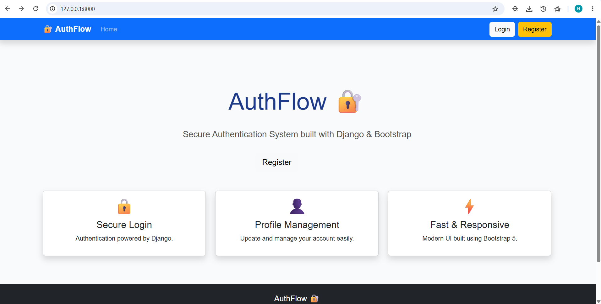
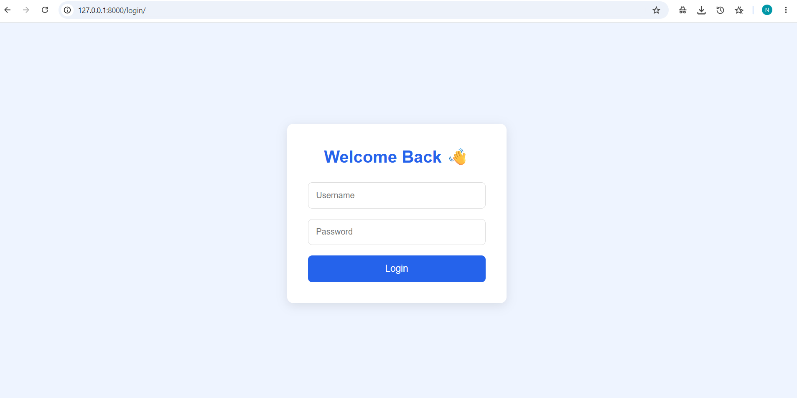
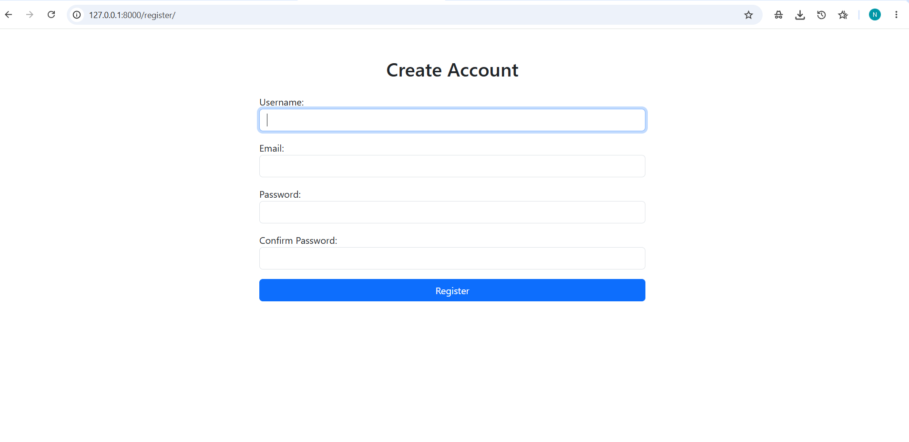
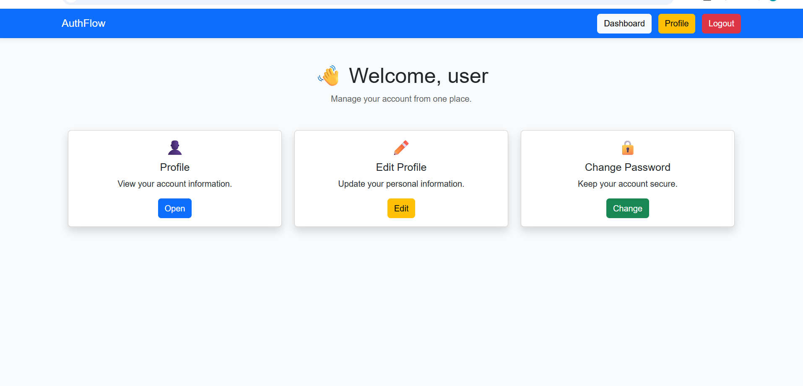
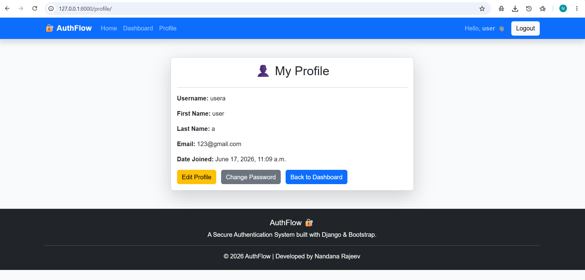

# 🔐 AuthFlow

A modern user authentication system built with **Django**, **Bootstrap 5**, and **SQLite**.

---

## ✨ Features

- 👤 User Registration
- 🔑 Secure Login & Logout
- 📋 User Dashboard
- 📝 Edit Profile
- 🔒 Change Password
- 💬 Flash Messages
- 📱 Responsive Navigation Bar
- 🎨 Bootstrap 5 UI

---

## 🛠 Tech Stack

- Python
- Django
- Bootstrap 5
- HTML5
- CSS3
- SQLite
- Git & GitHub

---

## 📷 Project Screenshots

### 🏠 Home Page



### 🔑 Login Page



### 📝 Register Page



### 📊 Dashboard



### 👤 Profile



---

## 📂 Project Structure

```
authflow/
│
├── accounts/
├── config/
├── screenshots/
├── requirements.txt
├── manage.py
└── README.md
```

---

## 🚀 Installation

```bash
git clone https://github.com/nandanack5/authflow-django.git

cd authflow-django

python -m venv venv

venv\Scripts\activate

pip install -r requirements.txt

python manage.py migrate

python manage.py runserver
```

Open:

```
http://127.0.0.1:8000/
```

---

## 🎯 Learning Outcomes

This project demonstrates:

- Django Authentication
- Django Forms
- Template Inheritance
- Bootstrap Integration
- Static File Management
- Git Version Control

---

## 🔮 Future Improvements

- Profile Picture Upload
- Email Verification
- Password Reset
- Dark Mode
- REST API Integration

---

## 👩‍💻 Developer

**Nandana Rajeev**

Computer Science Engineering Graduate | Python & Django Full Stack Developer